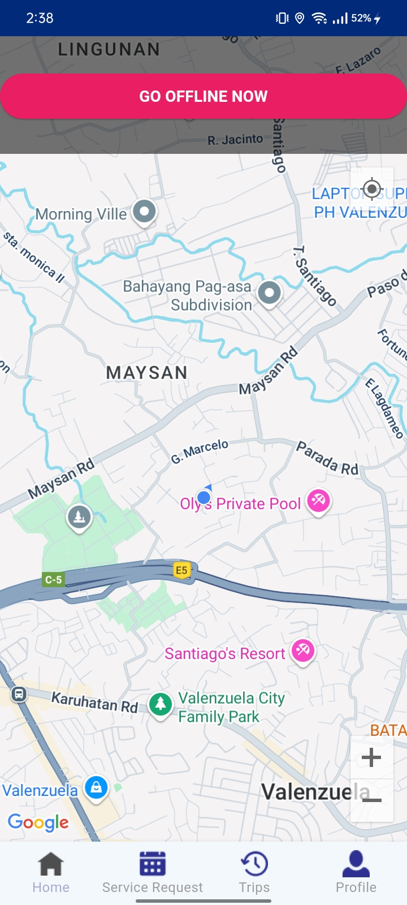
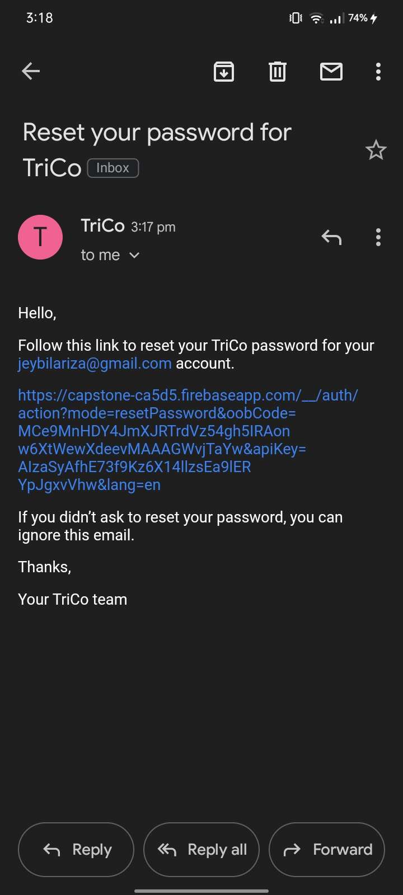
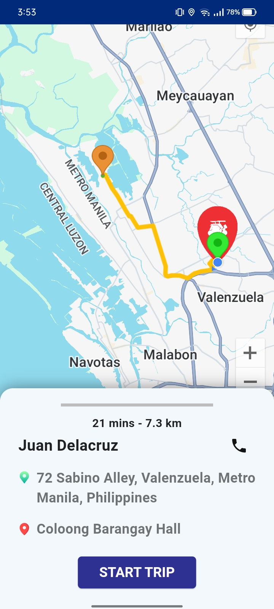
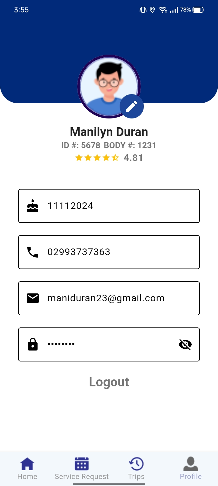
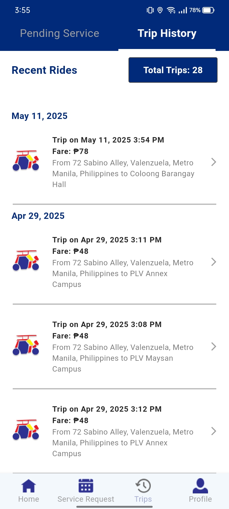
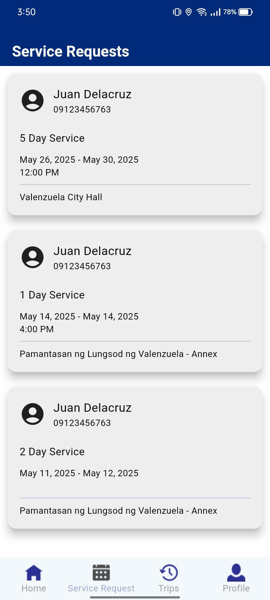
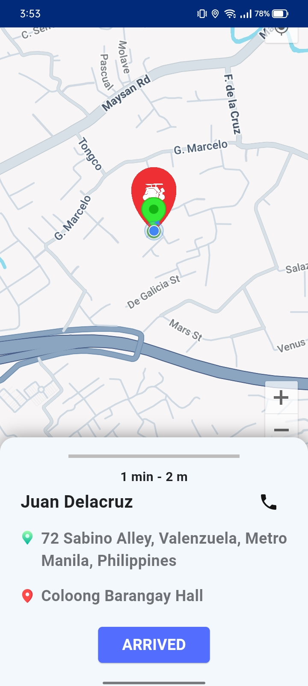
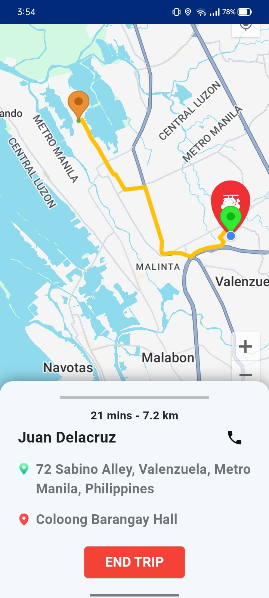
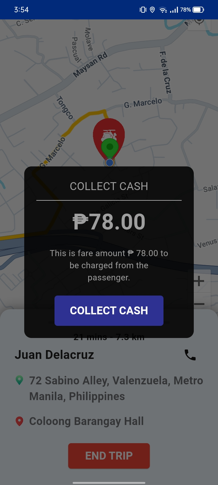
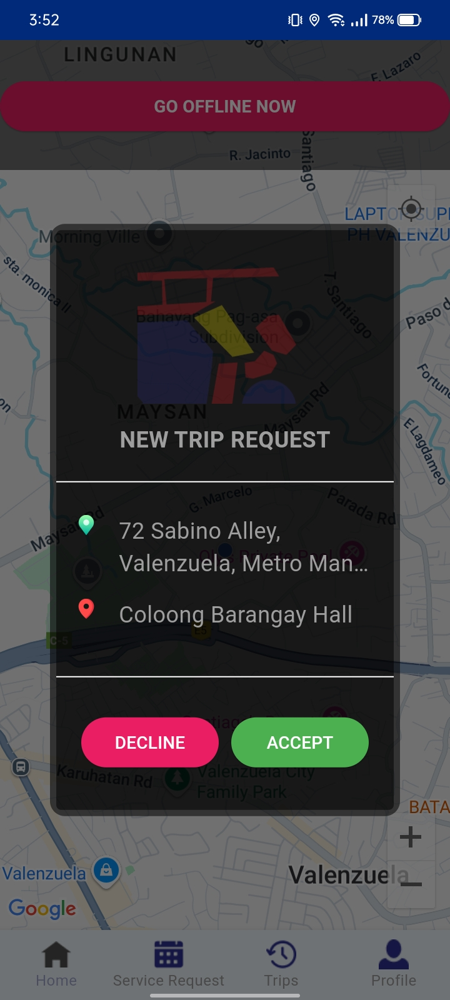

# 🚖 Tri.Co – Tricycle Ride-Hailing App

A community-centered mobile ride-hailing application designed to improve transportation for residents of **Barangay Coloong, Valenzuela City**.

---

## 🖼️ App Screenshots

<details>
<summary>📸 Click to expand screenshots (10)</summary>

<br>

<p float="left">
  
  
  
</p>

<p float="left">
  
  
  
</p>

<p float="left">
  
  
  
</p>

<p float="left">
  
</p>

</details>

---

## 📌 Project Summary

**Tri.Co** is a mobile-based ride-hailing application developed to solve the transportation challenges faced by the residents of Barangay Coloong, Valenzuela City. Recognizing the essential role tricycles play in daily commuting, Tri.Co modernizes the system by:

- Digitizing tricycle dispatch
- Enhancing passenger–driver interactions
- Providing GPS-powered trip tracking and service transparency


---

## ✨ Features of the System

### 👤 Account Management  
Secure profile management for both passengers and drivers, including:
- Profile updates
- Password recovery
- Safe login system

---

### 📲 Real-Time Ride Booking & Notifications  
- Instantly book nearby tricycles
- Get real-time updates: driver arrival, trip status, and ETA

---

### 📅 Advance Ride Scheduling  
- Schedule rides in advance for work, school, errands, or events
- Passengers set time and location
- Drivers receive notifications and reminders to stay on track

---

### 🚦 Ride Request & Availability Management  
- Drivers toggle between **online** and **offline** status
- Passengers only see available drivers

---

### 📑 Trip History, Receipts & Feedback  
- View previous rides, fare totals, and driver details
- Submit ratings and feedback

---

## 📸 App Demo

 

---

## 🛠️ Tech Stack

| Technology     | Usage                        |
|----------------|------------------------------|
| **Flutter**    | Cross-platform app UI        |
| **Dart**       | Core programming language    |
| **Firebase**   | Authentication, Firestore DB |
| **Google Maps**| Location & directions API    |
| **Agile Scrum**| Development methodology      |

---

<!-- ## 🚀 Getting Started

To run the project locally:

```bash
flutter pub get
flutter run -->


